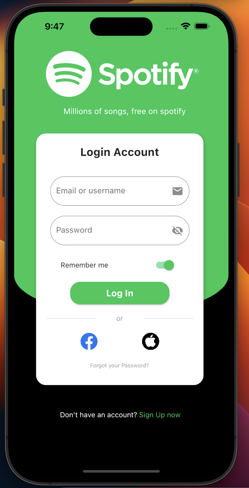

# Spotify UI Clone - Flutter

This is a demo Application made using the flutter framework. this Application does not support the Spotify music streaming capability.

**Diclamer** - This application is just a UI Clone of Spotify which is just made for testing Flutter Framework. This application does not offer any Music Streaming Capability or does not have any Data analysis Capabilities.

The Clone is created by [Ketan Aggarwal](https://github.com/ketanAggarwal58/) for demo purposes.

## The Application holds the following screens -

1. Login Screen
2. Home Screen [Supports the Dark Theme]
3. Music Player Page [Supports the Dark Theme]

## Screenshots

### *Login Screen*

